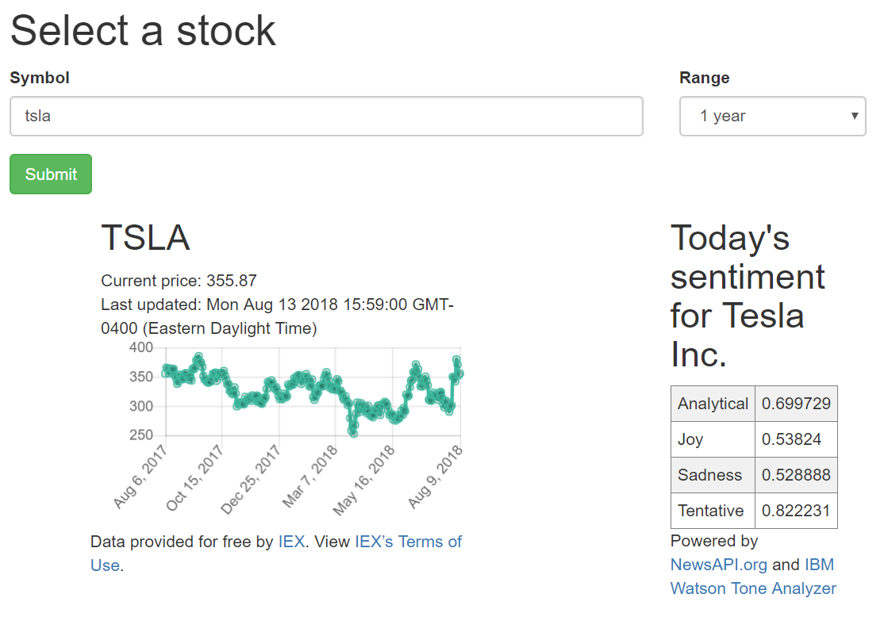

# fintech
## Example of the running web app

## Installation
1. Install [Docker](https://www.docker.com/get-started). If on Linux, you'll need to install [Docker Compose](https://docs.docker.com/compose/install/) separately. 
2. Clone this repository.
3. Open a terminal (Docker Quickstart Terminal if on Windows).
5. Run `docker-compose up` in the root directory of the cloned repository.
6. Navigate a web browser to http://localhost:4200. If using Docker Toolbox, you will need to navigate to http://192.168.99.100:4200/ instead; however, currently the backend does not work with Docker Toolbox.

## How it works
When a stock symbol and range is entered, a GET request is sent to the [IEX API](https://iextrading.com/developer/docs/) for the stock's price data over the specified time range. The data is then plotted using [chart.js](https://www.chartjs.org/). At the same time, a GET request is sent to [News API](https://newsapi.org/) for articles pertaining to the chosen company from a select number of financial news sources. Received news headlines are fed to the [IBM Watson Tone Analyzer](https://www.ibm.com/watson/services/tone-analyzer/) for sentiment analysis, which is then displayed on the web page.
